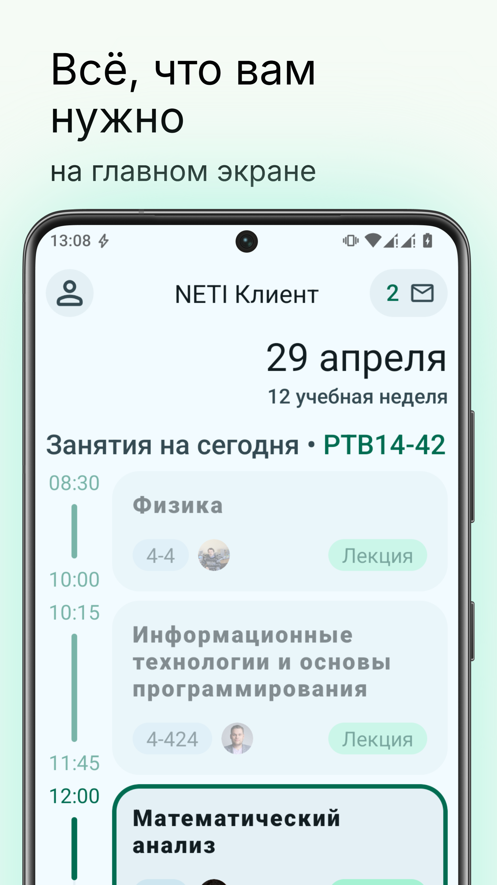
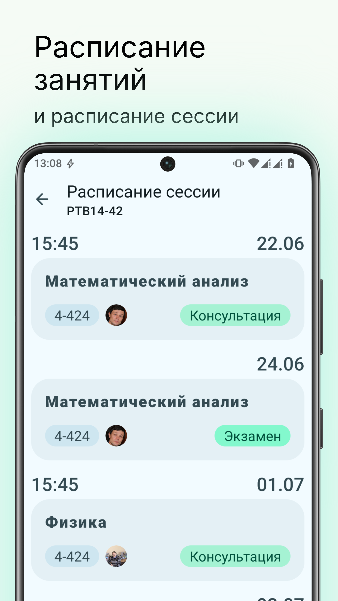
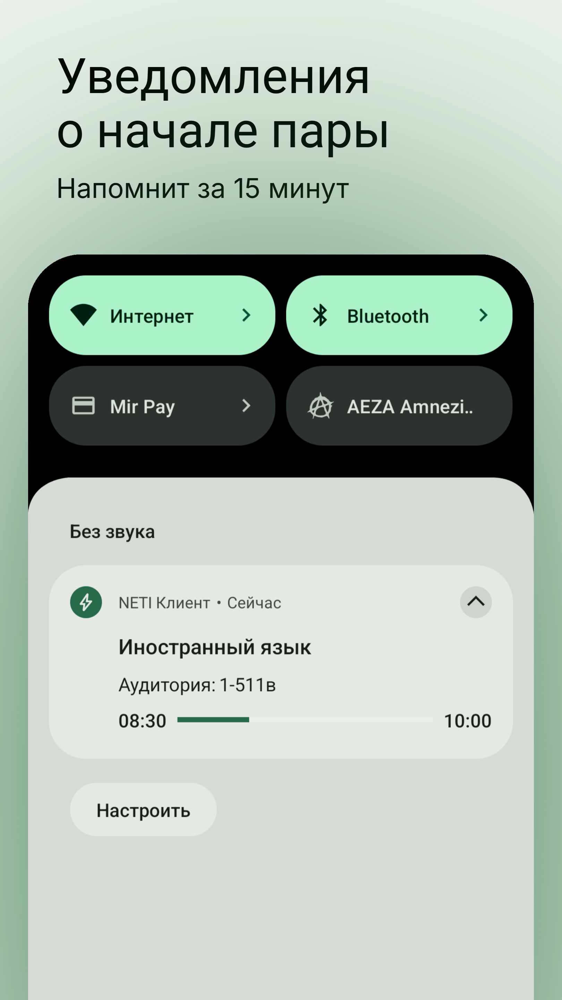
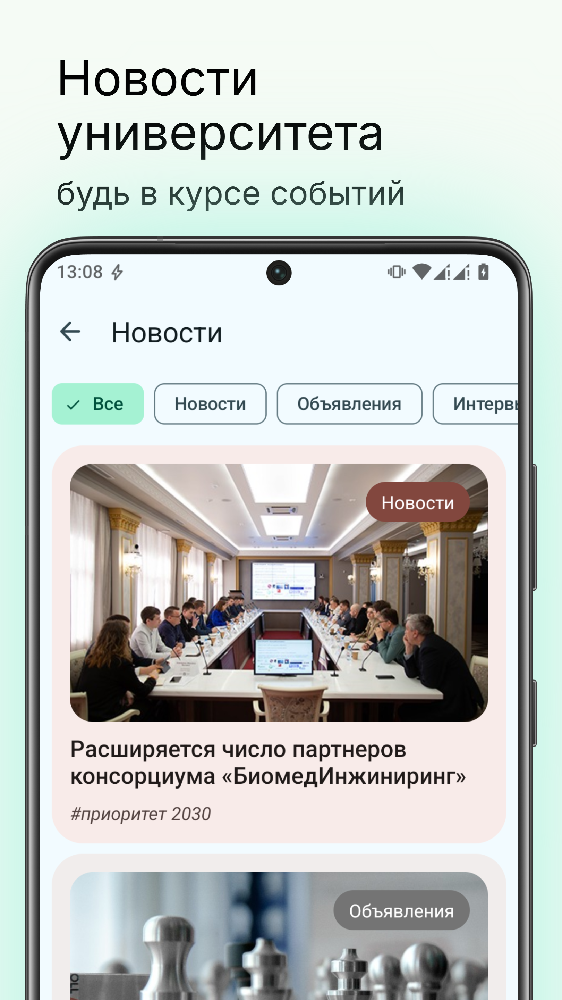
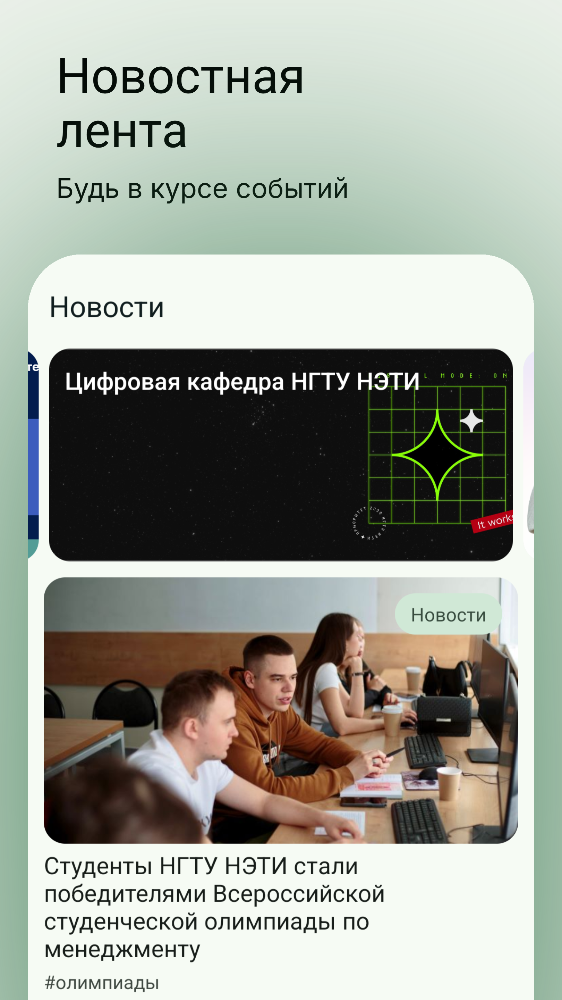
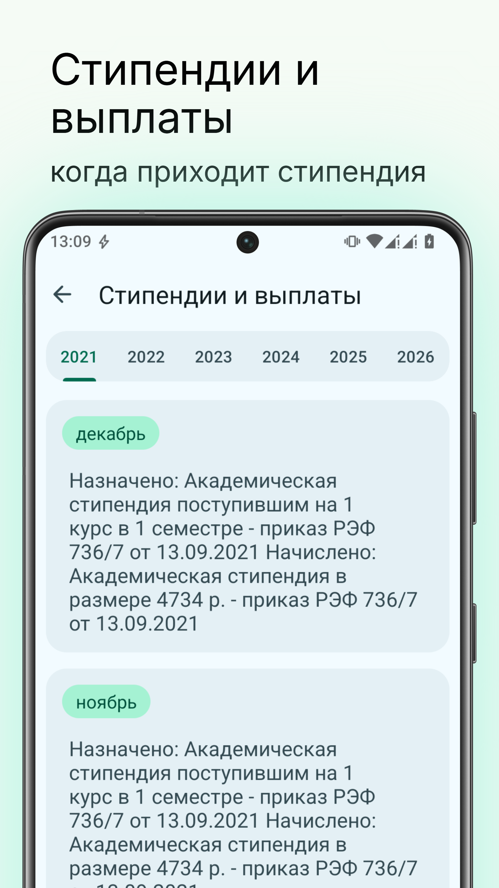
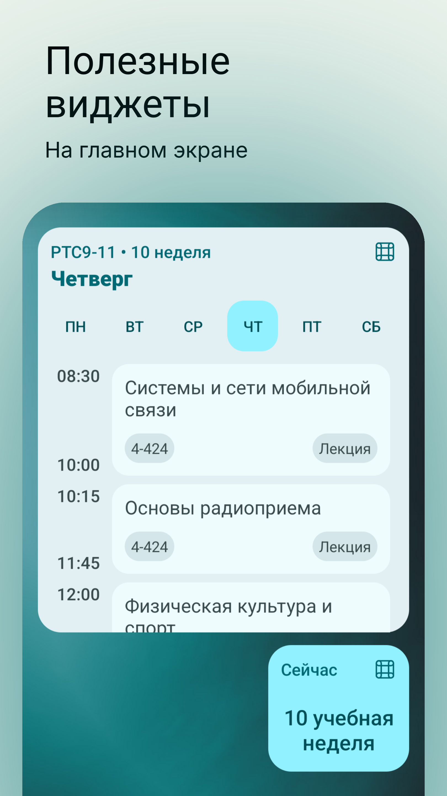
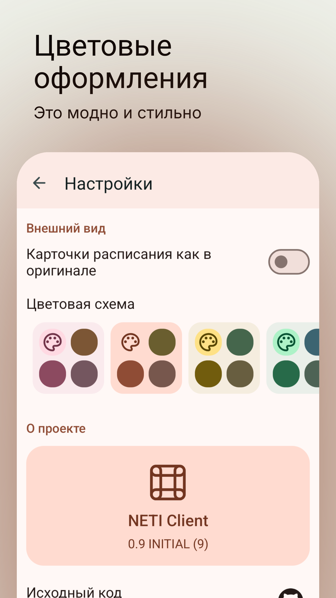

# NETI Клиент
Неофициальное приложение с открытым исходным кодом для студентов НГТУ (НЭТИ)

### Связь с разработчиком:
[Telegram](https://t.me/nstumobile_dev)
[VK](https://vk.com/neticient)

### Описание
На главном экране находится вся важная информация: текущая дата, номер учебной недели, а также расписание занятий.
Если сегодня пар нет - на главном экране отображается расписание на завтра или на ближайшую дату.
Чуть ниже вы сможете перейти к расписанию сессии или поиску преподавателей.
Ещё ниже - новостная лента университета.

Приложение поддерживает авторизацию в личном кабинете студента. При авторизации вы сможете просматривать сообщения от преподавателей и служб, вашу зачетку, а также информацию о стипендиях и выплатах.

В настройках вы можете включить отображение уведомлений о текущих и будущих занятиях. Приложение будет напоминать о следующей паре за 15 минут до начала.

Вы можете добавлять виджеты на рабочий стол. На текущий момент есть два виджета: виджет с номером учебной недели и виджет с расписанием занятий на текущую неделю.

Приложение поддерживает несколько цветовых оформлений. Вы можете переключить цветовую тему в настройках приложения

Приложение находится в активной разработке. Свои отзывы, предложения, а также отчёты об ошибках вы можете отправить разработчику приложения.

### Скриншоты:

  
  
  
  
  
  
  
  

### Текущий прогресс:
> Обозначения
> ✅  Реализовано
> ⚙️ Ведётся работа над этим
> ❌ Не планируется

| Функционал    | Статус  | Инфо                                                   |
|:-----------|:------:|:-------------------------------------------------------|
|Поиск учебной группы|✅| -                                                      |
|Авторизация в личном кабинете (ЛК) студента|✅| -                                                      |
|Расписание занятий для выбранной группы|✅| -                                                      |
|Синхронизация расписания с расписанием из ЛК|✅| При авторизации в ЛК                                   |
|Расписание сессии|✅|                                   |
|Новости (лента, открытие новостей) |✅| -                                                      |
|Сообщения от преподавателей и служб |✅| -                                                      |
|Редактирование контактной информации|✅| -                                                      |
|Сообщения от преподавателей и служб |✅| -                                                      |
|Результаты сессии |✅| -                                                      |
|Поделиться ссылкой для просмотра успеваемости |⚙️| -                                                      |
|Стипендии и выплаты |✅| -                                                      |
|Уведомления о текущей паре |✅| -                                                      |
|Уведомления о будущей паре |✅| Напоминание за 15 минут                                |
|Виджет с расписанием занятий |✅| -                                                      |
|Виджет с номером текущей недели |✅| -                                                      |
|Поиск сотрудников |✅| -                                                      |
|Страница сотрудника |✅| -                                                      |
|Расписание сотрудника |⚙️| Мне как-то лень                                        |
|Запись в бюро пропусков |⚙️| -                                                      |
|Заметки |⚙️| Предположительно будут совмещены с расписанием занятий |
|Интеграция DiSpace |❌| Лень + не нашёл логичного места для этого              |
|Заявки на документы |⚙️| -                                                      |
