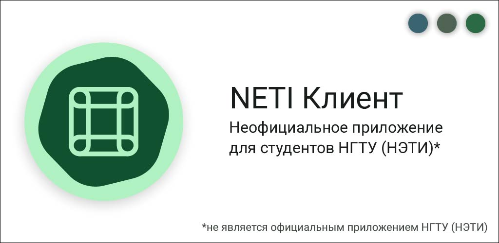

  

# NETI Клиент
Неофициальное приложение с открытым исходным кодом для студентов НГТУ (НЭТИ)

## Функционал приложения
+ Расписание занятий и расписание сессии
+ Результаты сессии (Зачётка)
+ Сообщения от преподавателей и служб
+ Новостная лента университета
+ Информация о стипендиях и выплатах
+ Уведомления о начале занятий
