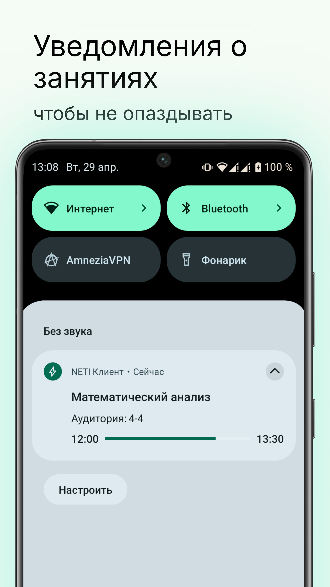
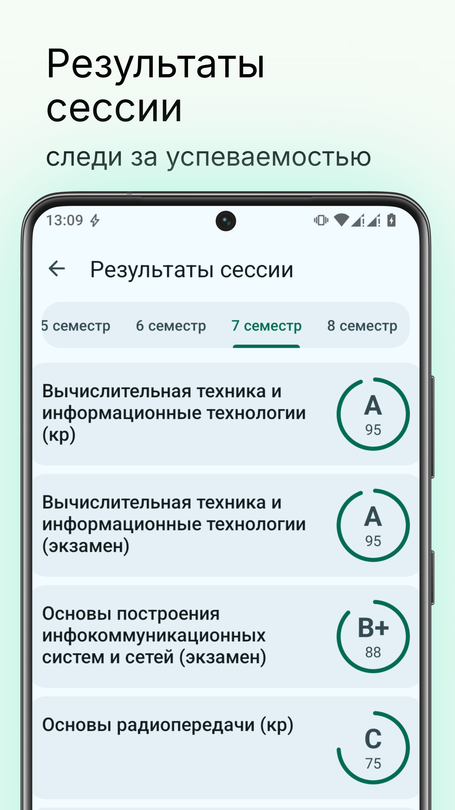
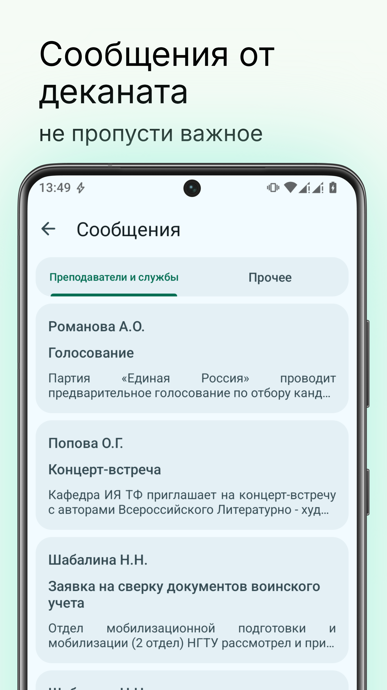
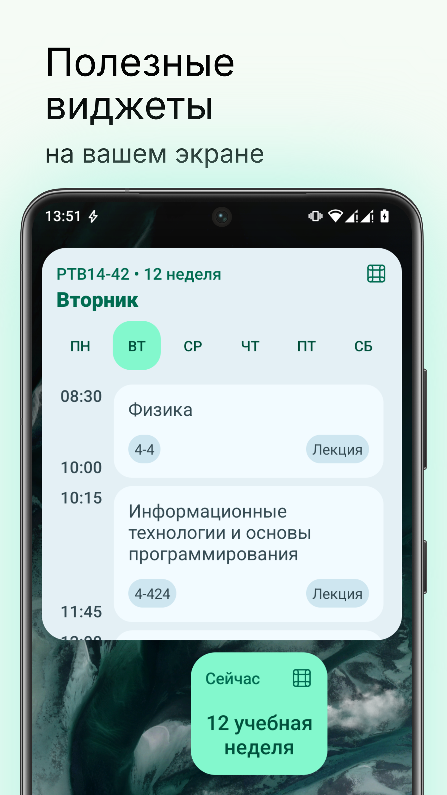

# NETI Клиент
Неофициальное приложение с открытым исходным кодом для студентов НГТУ (НЭТИ)

### Связь с разработчиком:
[Telegram](https://t.me/nstumobile_dev) 
[VK](https://vk.com/neticient)

### Скриншоты:

  
  
  
  
  
  
  
  

### Текущий прогресс:
> Обозначения
> ✅  Реализовано
> ⚙️ Ведётся работа над этим
> ❌ Не планируется

| Функционал    | Статус  | Инфо|
|:-----------|:------:|:----------:|
|Поиск учебной группы|✅| - |
|Авторизация в личном кабинете (ЛК) студента|✅| - |
|Расписание занятий для выбранной группы|✅| - |
|Синхронизация расписания с расписанием из ЛК|✅|При авторизации в ЛК|
|Расписание сессии|⚙️| Нужно доделать UI |
|Новости (лента, открытие новостей) |✅| - |
|Сообщения от преподавателей и служб |✅| - |
|Редактирование контактной информации|✅| - |
|Сообщения от преподавателей и служб |✅| - |
|Результаты сессии |✅| - |
|Поделиться ссылкой для просмотра успеваемости |⚙️| - |
|Стипендии и выплаты |✅| - |
|Уведомления о текущей паре |✅| - |
|Уведомления о будущей паре |✅| Напоминание за 15 минут |
|Виджет с расписанием занятий |✅| - |
|Виджет с номером текущей недели |✅| - |
|Поиск сотрудников |✅| - |
|Страница сотрудника |✅| - |
|Расписание сотрудника |⚙️| Мне как-то лень |
|Запись в бюро пропусков |⚙️| - |
|Заметки |⚙️| Предположительно будут совмещены с расписанием занятий |
|Интеграция DiSpace |❌| Лень + не нашёл логичного места для этого |
|Заявки на документы |⚙️| - |

